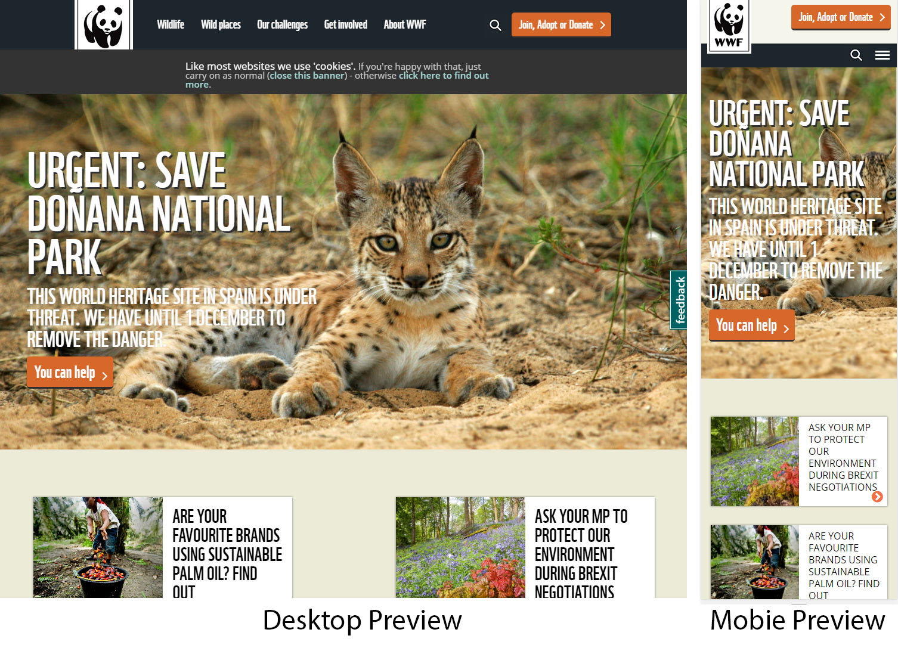

# Examples_of_different_responsive_webstes
3 Different websites with screenshots provided showing how they are responsive.

**Website name: WWF**

First responsive website that was looked at was the [www.wwf.org.uk](http://www.wwf.org.uk) 

